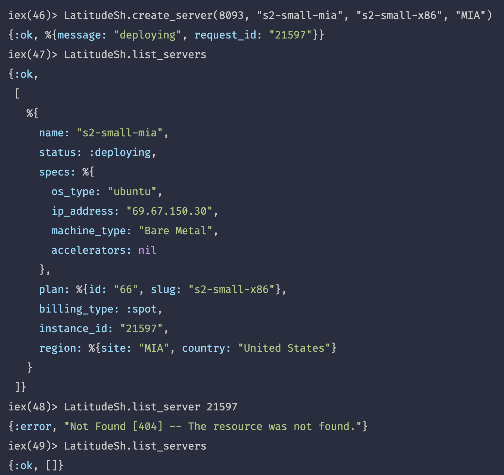

# LatitudeSh

## Setup

Before being able to use the system, it is important to set up a System variable named `LATITUDESH_APIKEY` used in the project. There are multiple ways to achieve this.

#### A: .env method

1. Prepare an API key (creating one on the Latitude.sh website if one is not already available).
2. Create a file in the `/config` folder called `.env`. (It should be excluded from `/config/.gitignore` already; this is for security purposes.)
3. Write the following into the `.env` file: `export LATITUDESH_APIKEY=''`. Between the quotes, paste in the API key.
4. Navigate to `path/to/repository/latitude_sh`. In the terminal, run `source config/.env`. This step needs repeating every time a new terminal is started.

These steps should allow the system to recognise the `LATITUDESH_APIKEY` variable used in this project. Tests assume there is at least one valid project ID.

#### B: direnv alternative

1. Ensure that direnv is installed.
2. Create a .envrc in your top level directory an put your environment variables inside it
   `# inside .envrc`
   `export LATITUDESH_APIKEY="super_secret_key"`
3. Make sure that environment variables are loaded before using application.
   `direnv allow`

## Intended use

This system is currently designed to be used in an integrated terminal (run `ies -S mix` in the `latitude.sh` folder to get started).

### Testing

Testing can be conducted by running `mix test`. Note that testing still requires a valid LATITUDESH_APIKEY environment variable; e.g. if using the `.env` alternative above, make sure to run `source config/.env` first.

**Note:** before running tests, make sure to have at least one valid project set up. You can check this with `fetch_projects/0`.

## Domain Notes

### Tokens
`fetch_access_token/0` does confirm that you are using a valid API key, but only returns the date of API version release your team is working with. Also, any other successful request to the site requires a valid API key. The site seems to conflate API keys and tokens in its [reference](https://docs.latitude.sh/reference/versioning).

### Billing
Latitude.sh's billing is at a team level, not individual server level. Also, hourly billing is charged for persistent servers, even when servers are not running.

### "Provisioning failure"
A successful API response from creating a server does not always guarantee that the instance was created properly. There is a possibility that a "provisioning error" occurred: e.g.
![Automatic email from LatitudeSh stating that "We have encountered a provisioning failure for your device [hostname]."](imgs/provisioning_failure.png)
This error does mean the server will disappear from the API, but not before a delay during which the API will recognise it (see below).

Pinging the server has not helped in testing. Since blocking creation by a couple of seconds we have not had further problems with this.

### Rate limits and runtime
Rate limit testing has been conducted, but so far no limit has been hit after > 4500 requests to the "/servers" endpoint. These requests take 0.3-0.4s when the user has no servers, but 0.7-0.8s when they have one or more. Repeated requests with even one server instantiated significantly slowed the rate of requests to 2-3s each.

### Blocking functions
Server creation (see "Provisioning failure") and starting/stopping takes some time to confirm or register at the system level. E.g. the response from starting or stopping will say "starting..." or "deploying...". But neither is blocking, and the status under `list_servers` will take around 5-8s to change. For that reason we have added blocking functionality until listing servers has an updated status.

### Pagination
The API utilizes Offset Pagination, The default page size is set to 20 and the default page number is 1. These parameters can be changed by including the page[size] and page[number] query paramters.

## Documentation

You can generate documentation by running `mix docs` and opening `doc/index.html` in your browser.
